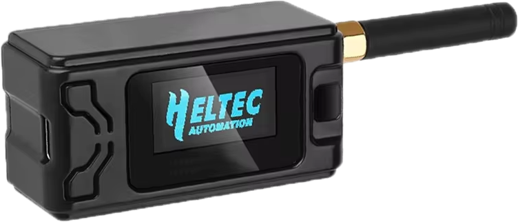
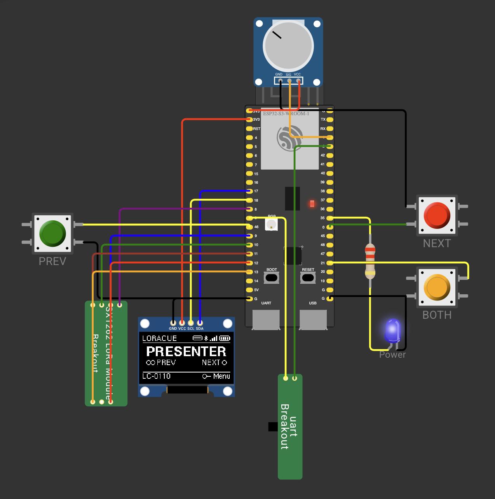

# LoRaCue - Enterprise LoRa Presentation Clicker

[](https://www.gnu.org/licenses/gpl-3.0)
[](https://github.com/espressif/esp-idf)
[](https://www.espressif.com/en/products/socs/esp32-s3)
[](https://github.com/LoRaCue/loracue/actions/workflows/build.yml)
[](https://wokwi.com/)
[](https://hannover.de)

> ⚠️ **DEVELOPMENT WARNING**: This project is under heavy development and not in a working state at the moment. Features are being actively implemented and the codebase is subject to frequent changes. Use at your own risk for development purposes only.

Enterprise-grade wireless presentation remote with long-range LoRa communication, featuring sub-50ms latency, hardware-accelerated encryption, and professional build quality. Designed for conference halls, auditoriums, and large presentation venues where traditional RF remotes fail.

## 🎯 **Key Features**

- **🌐 Long-Range Communication**: LoRa SX1262 transceiver with >100m range indoors
- **⚡ Ultra-Low Latency**: <50ms response time with optimized SF7/BW500kHz configuration  
- **🔒 Hardware Security**: AES-256 encryption with secure device pairing
- **🖥️ Universal Compatibility**: USB-HID keyboard emulation (works with any OS)
- **📱 OLED Display**: Real-time status, battery level, and connection feedback
- **🔋 Smart Power Management**: Weeks of battery life with intelligent sleep modes
- **🔄 OTA Updates**: Wireless firmware updates with dual-partition safety
- **🎮 Perfect Simulation**: Full Wokwi simulator support for development

## 🏗️ **Hardware Architecture**

### **Current Prototyping Hardware: Heltec LoRa V3**



**Currently Supported Hardware:**
- **Heltec WiFi LoRa 32 V3** - Our primary development and prototyping platform
- **MCU**: ESP32-S3 (Dual-core Xtensa LX7, 240MHz)
- **LoRa**: SX1262 transceiver (868/915MHz)
- **Display**: SH1106 OLED (128x64, I2C)
- **Flash**: 8MB SPI Flash with OTA partitioning
- **Power**: USB-C charging with battery monitoring

> ⚠️ **Hardware Support Status**: The Heltec LoRa V3 is currently the **only officially supported hardware**. While our Board Support Package (BSP) architecture is designed to support any ESP32-S3 board with SX12XX LoRa modules, only the Heltec V3 has been tested and verified.

**Future Hardware Plans:**
- **Dedicated PCB Design**: Custom ergonomic form factor optimized for presentation use
- **Enhanced Controls**: Multiple buttons and rotary encoder for intuitive navigation
- **Professional Build**: Injection-molded housing with premium materials
- **Extended Battery**: Longer runtime with optimized power management

### **Wokwi Simulation Setup**


The project includes a complete Wokwi simulation environment with:
- ESP32-S3 microcontroller simulation
- SSD1306 OLED display (SH1106 compatible)
- Interactive buttons and LED feedback
- Real-time serial monitoring
- Perfect development workflow integration

## 🛠️ **Development Workflow**

### **BSP (Board Support Package) Architecture**

Our innovative BSP abstraction layer enables seamless development across real hardware and simulation:

```
components/bsp/
├── bsp_heltec_v3.c      # Real hardware (SH1106 OLED)
├── bsp_wokwi.c          # Wokwi simulation (SSD1306 OLED)  
├── include/bsp.h        # Hardware-agnostic interface
└── CMakeLists.txt       # Conditional compilation
```

**Automatic BSP Selection**:
- **Hardware Build**: Uses `bsp_heltec_v3.c` with SH1106 driver
- **Simulator Build**: Uses `bsp_wokwi.c` with SSD1306 driver
- **Same API**: Application code remains unchanged
- **Perfect Compatibility**: Identical pinout and behavior

### **Makefile-Driven Development**

Our comprehensive Makefile provides a streamlined development experience:

```bash
# 🔨 Build Commands
make build          # Build for real hardware (Heltec V3)
make rebuild        # Clean and rebuild project
make clean          # Clean build artifacts
make size           # Show binary size information
make menuconfig     # Configure ESP-IDF project settings
make set-target     # Set ESP-IDF target (esp32s3)

# 🎮 Simulation Commands  
make sim            # Build for Wokwi simulator
make sim-run        # Build and run Wokwi simulation
make sim-debug      # Interactive simulation with serial monitor
make sim-screenshot # Capture OLED display screenshot
make sim-web        # Run simulation in web browser
make sim-info       # Show Wokwi simulation information

# 📡 Hardware Commands
make flash          # Flash firmware to connected device
make monitor        # Serial monitor for debugging
make flash-monitor  # Flash and immediately start monitoring
make erase          # Erase entire flash memory

# 🌐 Web Interface Commands
make web-build      # Build web interface for WiFi configuration
make web-dev        # Start web interface development server

# 🔧 Development Tools
make format         # Format code with clang-format
make format-check   # Check code formatting without changes
make lint           # Static code analysis with cppcheck
make env-info       # Show development environment information

# 🚀 Quick Start
make dev            # Setup environment and run simulation
make all            # Default target (build)
make help           # Show all available commands

# ✅ Environment Checks
make check-idf      # Verify ESP-IDF installation
make check-wokwi    # Verify Wokwi CLI installation
make setup-env      # Setup development environment
```

**Key Benefits**:
- **One Command Simulation**: `make sim-run` builds and starts Wokwi instantly
- **Automatic Environment**: ESP-IDF setup handled automatically
- **Cross-Platform**: Works on macOS, Linux, and Windows
- **CI/CD Ready**: GitHub Actions integration for automated testing
- **Web Development**: Integrated web interface build system

### **Simulation-First Development**

1. **🎮 Develop in Wokwi**: Perfect hardware simulation with instant feedback
2. **🔄 Iterate Rapidly**: No hardware flashing delays, instant code changes
3. **🧪 Test Thoroughly**: Interactive buttons, OLED display, LED feedback
4. **📱 Deploy to Hardware**: Same codebase runs on real Heltec V3 boards

## 🚀 **Quick Start**

### **Prerequisites**

```bash
# Install ESP-IDF v5.5
git clone -b v5.5 --recursive https://github.com/espressif/esp-idf.git
cd esp-idf && ./install.sh && source ./export.sh

# Install Node.js (for development tools)
npm install -g @commitlint/cli @commitlint/config-conventional

# Install Wokwi CLI (for simulation)
npm install -g @wokwi/cli
```

### **Development Setup**

```bash
# Clone repository
git clone https://github.com/LoRaCue/loracue.git
cd LoRaCue

# Install development dependencies
npm install

# Build and run simulation
make sim-run
```

### **Hardware Development**

```bash
# Build for real hardware
make build

# Flash to connected Heltec V3
make flash-monitor
```

## 📁 **Project Structure**

```
LoRaCue/
├── 📁 main/                    # Main application
├── 📁 components/              # Modular components
│   ├── 📁 bsp/                # Board Support Package
│   ├── 📁 button_manager/     # Button event handling
│   ├── 📁 led_manager/        # LED pattern control
│   ├── 📁 oled_ui/           # Display user interface
│   ├── 📁 lora/              # LoRa communication
│   ├── 📁 usb_hid/           # USB keyboard emulation
│   ├── 📁 power_mgmt/        # Power management
│   └── 📁 device_registry/   # Secure device pairing
├── 📁 docs/                   # Documentation
├── 📁 .github/workflows/     # CI/CD automation
├── 📄 diagram.json           # Wokwi simulation diagram
├── 📄 partitions.csv         # Flash memory layout
├── 📄 Makefile              # Development commands
└── 📄 README.md             # This file
```

## 🔧 **Technical Specifications**

### **Communication Protocol**
- **Frequency**: 868MHz (EU) / 915MHz (US)
- **Modulation**: LoRa with SF7, BW500kHz for low latency
- **Range**: >100m indoors, >1km line-of-sight
- **Encryption**: AES-256 with rolling codes
- **Pairing**: Secure USB-based device registration

### **Power Management**
- **Battery Life**: 2-4 weeks typical usage
- **Sleep Modes**: Deep sleep <10µA, light sleep <1mA
- **Charging**: USB-C with battery monitoring
- **Low Battery**: OLED warnings and graceful shutdown

### **Memory Layout (8MB Flash)**
```
├── Bootloader (32KB)
├── Partition Table (4KB)
├── NVS Storage (24KB)
├── Factory App (2MB)
├── OTA App 0 (2MB)
├── OTA App 1 (2MB)
├── SPIFFS (1.9MB)
└── Coredump (56KB)
```

## 🤝 **Contributing**

We welcome contributions! Please follow our development workflow:

1. **🍴 Fork** the repository
2. **🌿 Create** a feature branch (`git checkout -b feature/amazing-feature`)
3. **🎮 Develop** using Wokwi simulation (`make sim-run`)
4. **✅ Test** on real hardware if available
5. **📝 Commit** using conventional commits (`git commit -m 'feat: add amazing feature'`)
6. **🚀 Push** to your branch (`git push origin feature/amazing-feature`)
7. **📬 Open** a Pull Request

### **Commit Convention**
We use [Conventional Commits](https://www.conventionalcommits.org/):
- `feat:` New features
- `fix:` Bug fixes  
- `docs:` Documentation changes
- `style:` Code formatting
- `refactor:` Code restructuring
- `test:` Adding tests
- `chore:` Maintenance tasks

## 📋 **Development Roadmap**

- [x] **Foundation**: ESP-IDF project structure and BSP abstraction
- [x] **Simulation**: Complete Wokwi environment with SSD1306 support
- [x] **UI Framework**: OLED display system and button management
- [x] **Power Management**: Sleep modes and battery monitoring
- [ ] **LoRa Communication**: SX1262 driver and protocol implementation
- [ ] **USB HID**: Keyboard emulation and OS compatibility
- [ ] **Security**: AES encryption and secure pairing
- [ ] **OTA Updates**: Wireless firmware update system
- [ ] **Production**: Hardware testing and certification

## 📄 **License**

This project is licensed under the **GNU General Public License v3.0** - see the [LICENSE](LICENSE) file for details.

## 🏙️ **Made with ❤️ in Hannover**
