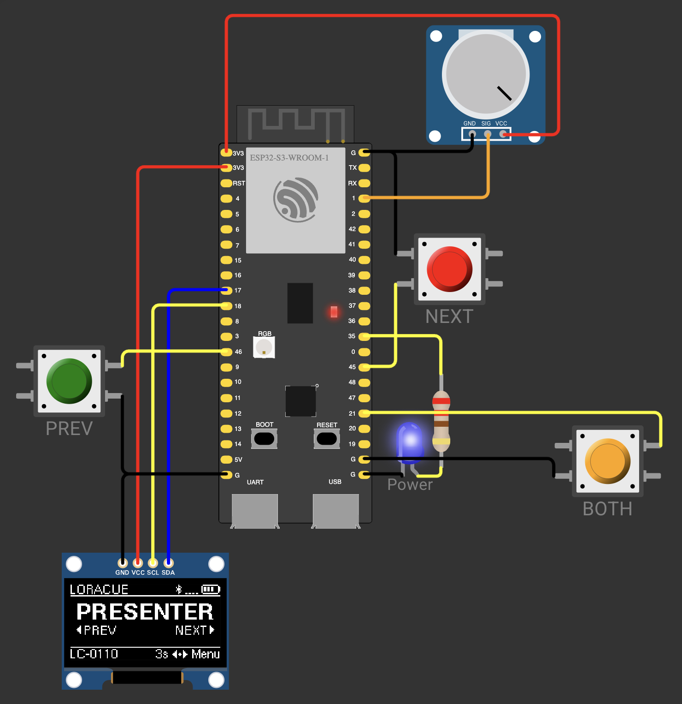

# LoRaCue - Enterprise LoRa Presentation Clicker

[](https://www.gnu.org/licenses/gpl-3.0)
[](https://github.com/espressif/esp-idf)
[](https://www.espressif.com/en/products/socs/esp32-s3)
[](https://github.com/LoRaCue/loracue/actions/workflows/build.yml)
[](https://wokwi.com/)
[](https://hannover.de)

> ⚠️ **DEVELOPMENT WARNING**: This project is under heavy development and not in a working state at the moment. Features are being actively implemented and the codebase is subject to frequent changes. Use at your own risk for development purposes only.

Enterprise-grade wireless presentation remote with long-range LoRa communication, featuring sub-50ms latency, hardware-accelerated encryption, and professional build quality. Designed for conference halls, auditoriums, and large presentation venues where traditional RF remotes fail.

## 🎯 Key Features

- **🌐 Long-Range Communication**: LoRa SX1262 transceiver with >100m range indoors
- **⚡ Ultra-Low Latency**: <50ms response time with optimized SF7/BW500kHz configuration  
- **🔒 Hardware Security**: AES-256 encryption with secure device pairing and OTA updates
- **🖥️ Universal Compatibility**: USB-HID keyboard emulation (works with any OS)
- **📱 OLED/E-Paper Display**: Real-time status, battery level, and connection feedback
- **🔋 Smart Power Management**: Weeks of battery life with intelligent sleep modes
- **🔄 OTA Updates**: Wireless firmware updates with dual-partition safety and signature verification
- **🌐 WiFi Config Portal**: Built-in web server for easy device configuration (Name, LoRa settings, Pairing, OTA trigger)
- **⚙️ JSON-RPC API**: Robust command interface over USB-CDC and WiFi for advanced control
- **🎮 Perfect Simulation**: Full Wokwi simulator support for development

## 🏗️ Hardware Architecture

### Supported Hardware & Models

LoRaCue is designed for a variety of ESP32-S3 based boards with SX126x LoRa modules. Our Board Support Package (BSP) and Kconfig-driven build system ensure optimal configuration for each model.

*   **LC-Alpha (Heltec WiFi LoRa 32 V3)**
    *   Primary development platform.
    *   **MCU**: ESP32-S3
    *   **LoRa**: SX1262 (868/915MHz)
    *   **Display**: SSD1306 OLED (128x64, I2C)
    *   **Features**: Single onboard button (GPIO0).
*   **LC-Alpha+ (Heltec WiFi LoRa 32 V3)**
    *   Enhanced variant of LC-Alpha with dual external buttons.
    *   **Features**: Two external buttons (prev/next).
*   **LC-Beta (LilyGO T3-S3)**
    *   Compact model with an E-Paper display.
    *   **MCU**: ESP32-S3
    *   **LoRa**: SX1262
    *   **Display**: SSD1681 E-Paper (2.13", SPI)
    *   **Features**: Dual buttons.
*   **LC-Gamma (LilyGO T5 Pro)**
    *   Professional model with larger E-Paper display and touch.
    *   **MCU**: ESP32-S3
    *   **LoRa**: SX1262
    *   **Display**: SSD1681 E-Paper (4.7", SPI)
    *   **Features**: Touch interface.

### Wokwi Simulation Setup


The project includes a complete Wokwi simulation environment with:
- ESP32-S3 microcontroller simulation
- SSD1306 OLED display
- Interactive buttons and LED feedback
- Real-time serial monitoring
- Perfect development workflow integration

## 🛠️ Development Workflow

### BSP (Board Support Package) Architecture

Our innovative BSP abstraction layer enables seamless development across real hardware and simulation, now powered by Kconfig for strict compile-time selection:

```
components/bsp/
├── bsp_heltec_v3.c      # Heltec V3 implementation
├── bsp_lilygo_t3.c      # LilyGO T3 implementation
├── bsp_lilygo_t5.c      # LilyGO T5 implementation
├── bsp_wokwi.c          # Wokwi simulation implementation
├── include/bsp.h        # Hardware-agnostic interface
└── CMakeLists.txt       # Kconfig-driven conditional compilation
```

**Kconfig-Driven BSP Selection**:
- Board selection is handled via `idf.py menuconfig` (`LORACUE_MODEL` choice).
- The build system (CMake) automatically includes only the necessary BSP and display driver source files.
- `make build MODEL=...` still works as a shortcut but relies on `sdkconfig` overrides.

### Makefile-Driven Development

Our comprehensive Makefile provides a streamlined development experience:

```bash
# 🔨 Build Commands
make build              # Build current Kconfig selection
make build MODEL=alpha  # Build LC-Alpha (Heltec V3, 1 button)
make build MODEL=alpha+ # Build LC-Alpha+ (Heltec V3, 2 buttons)
make build MODEL=beta   # Build LC-Beta (LilyGO T3, E-paper)
make build MODEL=gamma  # Build LC-Gamma (LilyGO T5, E-paper)
make rebuild            # Clean and rebuild project
make clean              # Clean build artifacts
make size               # Show binary size information
make menuconfig         # Configure ESP-IDF project settings
make set-target         # Set ESP-IDF target (esp32s3)

# 🎮 Simulation Commands  
make sim            # Build for Wokwi simulator (uses default Heltec V3 config)
make sim-run        # Build and run Wokwi simulation
make sim-debug      # Interactive simulation with serial monitor
make sim-screenshot # Capture OLED display screenshot
make sim-web        # Run simulation in web browser
make sim-info       # Show Wokwi simulation information

# 📡 Hardware Commands
make flash              # Flash current Kconfig selection
make flash MODEL=alpha  # Flash LC-Alpha
make flash MODEL=alpha+ # Flash LC-Alpha+
make flash MODEL=beta   # Flash LC-Beta
make flash MODEL=gamma  # Flash LC-Gamma
make monitor            # Serial monitor for debugging
make flash-monitor MODEL=alpha  # Flash and monitor LC-Alpha
make flash-monitor MODEL=alpha+ # Flash and monitor LC-Alpha+
make flash-monitor MODEL=beta   # Flash and monitor LC-Beta
make flash-monitor MODEL=gamma  # Flash and monitor LC-Gamma
make erase              # Erase entire flash memory

# 🌐 Web Interface Commands
make web-build      # Build web interface for WiFi configuration
make web-dev        # Start web interface development server

# 🔧 Development Tools
make format         # Format code with clang-format
make format-check   # Check code formatting without changes
make lint           # Static code analysis with cppcheck
make env-info       # Show development environment information

# 🚀 Quick Start
make dev            # Setup environment and run simulation
make all            # Default target (build)
make help           # Show all available commands

# ✅ Environment Checks
make check-idf      # Verify ESP-IDF installation
make check-wokwi    # Verify Wokwi CLI installation
make setup-env      # Setup development environment
```

**Key Benefits**:
- **One Command Simulation**: `make sim-run` builds and starts Wokwi instantly
- **Automatic Environment**: ESP-IDF setup handled automatically
- **Cross-Platform**: Works on macOS, Linux, and Windows
- **CI/CD Ready**: GitHub Actions integration for automated testing
- **Web Development**: Integrated web interface build system

### Simulation-First Development

1. **🎮 Develop in Wokwi**: Perfect hardware simulation with instant feedback
2. **🔄 Iterate Rapidly**: No hardware flashing delays, instant code changes
3. **🧪 Test Thoroughly**: Interactive buttons, OLED display, LED feedback
4. **📱 Deploy to Hardware**: Same codebase runs on real Heltec V3 boards

## 🚀 Quick Start

### Prerequisites

```bash
# Install ESP-IDF v5.5
git clone -b v5.5 --recursive https://github.com/espressif/esp-idf.git
cd esp-idf && ./install.sh && source ./export.sh

# Install Node.js (for development tools)
npm install -g @commitlint/cli @commitlint/config-conventional

# Install Wokwi CLI (for simulation)
npm install -g @wokwi/cli
```

### Development Setup

```bash
# Clone repository
git clone https://github.com/LoRaCue/loracue.git
cd LoRaCue

# Install development dependencies
npm install

# Build and run simulation
make sim-run
```

### Hardware Development

```bash
# Build for real hardware
make build MODEL=alpha

# Flash to connected device
make flash-monitor MODEL=alpha
```

### For End Users

Use **[LoRaCue Manager](https://github.com/LoRaCue/loracue-manager)** to flash firmware to your devices. It provides automatic device detection, one-click updates, and cross-platform support.

## 🏛️ Software Architecture

LoRaCue follows enterprise-grade design principles with complete separation of concerns, thread-safe state management, and event-driven communication.

### Component Architecture

```
┌─────────────────────────────────────────────────────────────────┐
│                         Main Application                         │
│  ┌────────────────────────────────────────────────────────────┐ │
│  │ main.c: Initialization & Coordination (minimal logic)      │ │
│  └────────────────────────────────────────────────────────────┘ │
└───────────────┬─────────────────────────────────┬───────────────┘
                │                                 │
    ┌───────────▼──────────┐         ┌───────────▼──────────┐
    │  Presenter Mode      │         │    PC Mode           │
    │  Manager             │         │    Manager           │
    ├──────────────────────┤         ├──────────────────────┤
    │ • Button → LoRa TX   │         │ • LoRa RX → USB HID  │
    │ • Command mapping    │         │ • Active presenters  │
    │ • Reliable/unreliable│         │ • Rate limiting      │
    │ • Thread-safe state  │         │ • Command history    │
    └──────────┬───────────┘         └───────────┬──────────┘
               │                                 │
               │         ┌───────────────────────┘
               │         │
    ┌──────────▼─────────▼──────────┐    ┌────────────────────┐
    │    System Events               │    │  commands (JSON-RPC) │
    │  (Event-Driven Communication)  │    ├────────────────────┤
    ├────────────────────────────────┤    │ • USB-CDC / WiFi   │
    │ • PC_COMMAND_RECEIVED          │    │ • Dispatch to API  │
    │ • DEVICE_CONFIG_CHANGED        │    └─────────┬──────────┘
    │ • LORA_COMMAND                 │              │
    │ • Thread-safe event posting    │    ┌─────────▼──────────┐
    └──────────┬─────────────────────┘    │ commands_api (Core)│
               │                            ├────────────────────┤
    ┌──────────▼─────────────────────┐    │ • Get/Set Config   │
    │       UI Mini                   │    │ • Device Pairing   │
    │  (Display & User Interface)     │    │ • OTA Management   │
    ├─────────────────────────────────┤    └────────────────────┘
    │ • Encapsulated state (private)  │
    │ • Thread-safe accessors         │
    │ • OLED/E-Paper screen mgmt      │
    │ • Event-driven updates          │
    └─────────────────────────────────┘
```

### Design Principles

**1. Separation of Concerns**
- **Presenter Mode Manager**: Handles button events → LoRa transmission
- **PC Mode Manager**: Handles LoRa reception → USB HID forwarding
- **UI Mini/Rich**: Manages display state and rendering (no business logic)
- **commands_api**: Core business logic and system control (decoupled from transport)
- **commands**: JSON-RPC adapter, solely responsible for API parsing/serialization.
- **Main**: Minimal initialization and coordination only

**2. Thread Safety**
- All shared state protected by mutexes
- Thread-safe accessor functions for UI state
- No global variables exposed externally

**3. Event-Driven Communication**
- Components communicate via system events (e.g., `DEVICE_CONFIG_CHANGED`, `LORA_COMMAND`)
- Loose coupling between modules, easy to extend with new event types

**4. Encapsulated State**
- UI state is private to `ui_mini.c` (or `ui_rich.c`)
- Accessed only via accessor functions
- Runtime state merged with config data dynamically

### Data Flow

**Configuration / API Access (e.g., via USB-CDC or WiFi)**
```
USB/WiFi (JSON-RPC) → commands (Adapter) → commands_api (Core Logic) → Configuration (NVS), Peripherals (BSP), Events
```

**Presenter Mode (Button → LoRa)**
```
Button Press → Button Manager → Presenter Mode Manager → LoRa Protocol → Radio TX
                                        ↓
                                  System Event → UI Update
```

**PC Mode (LoRa → USB HID)**
```
Radio RX → LoRa Protocol → PC Mode Manager → USB HID → Computer
                                  ↓
                            System Event → UI Update
```

## 📁 Project Structure

```
LoRaCue/
├── 📁 main/                          # Main application
│   └── main.c                        # Initialization only (~50 lines)
├── 📁 components/                    # Modular components
│   ├── 📁 bsp/                      # Board Support Package (Kconfig-driven)
│   ├── 📁 commands/                 # JSON-RPC adapter & Core API
│   │   ├── commands.c              # JSON-RPC parsing/serialization
│   │   ├── commands_api.c/.h       # Core business logic (type-safe C API)
│   │   └── include/commands.h      # Public API for JSON-RPC
│   ├── 📁 button_manager/           # Button event handling
│   ├── 📁 led_manager/              # LED pattern control
│   ├── 📁 presenter_mode_manager/   # Button → LoRa TX logic
│   ├── 📁 pc_mode_manager/          # LoRa RX → USB HID logic
│   ├── 📁 ui_compact/               # UI for OLED displays
│   ├── 📁 ui_rich/                  # UI for E-Paper displays
│   ├── 📁 lora/                     # LoRa communication & protocol
│   ├── 📁 usb_hid/                  # USB keyboard emulation
│   ├── 📁 power_mgmt/               # Power management & NVS config
│   ├── 📁 system_events/            # Event-driven communication bus
│   ├── 📁 device_registry/          # Secure device pairing & NVS storage
│   ├── 📁 config_wifi_server/       # WiFi AP for web config portal
│   └── 📁 ota_engine/               # OTA update management
├── 📁 docs/                         # Documentation
├── 📁 .github/workflows/            # CI/CD automation
├── 📄 diagram.json                  # Wokwi simulation diagram
├── 📄 partitions.csv                # Flash memory layout
├── 📄 Makefile                      # Development commands
└── 📄 README.md                     # This file
```

## 🔧 Technical Specifications

### Communication Protocol
- **Frequency**: 868MHz (EU) / 915MHz (US)
- **Modulation**: LoRa with SF7, BW500kHz for low latency
- **Range**: >100m indoors, >1km line-of-sight
- **Encryption**: AES-256 with rolling codes
- **Pairing**: Secure USB-based device registration, configurable via API

### Power Management
- **Battery Life**: 2-4 weeks typical usage
- **Sleep Modes**: Deep sleep <10µA, light sleep <1mA
- **Charging**: USB-C with battery monitoring
- **Low Battery**: OLED warnings and graceful shutdown

### Memory Layout (8MB Flash)
```
├── Bootloader (32KB)
├── Partition Table (4KB)
├── NVS Storage (24KB)
├── Factory App (2MB)
├── OTA App 0 (2MB)
├── OTA App 1 (2MB)
├── SPIFFS (1.9MB)
└── Coredump (56KB)
```

## 🤝 Contributing

We welcome contributions! Please follow our development workflow:

1. **🍴 Fork** the repository
2. **🌿 Create** a feature branch (`git checkout -b feature/amazing-feature`)
3. **🎮 Develop** using Wokwi simulation (`make sim-run`)
4. **✅ Test** on real hardware if available
5. **📝 Commit** using conventional commits (`git commit -m 'feat: add amazing feature'`)
6. **🚀 Push** to your branch (`git push origin feature/amazing-feature`)
7. **📬 Open** a Pull Request

### Commit Convention
We use [Conventional Commits](https://www.conventionalcommits.org/):
- `feat:` New features
- `fix:` Bug fixes  
- `docs:` Documentation changes
- `style:` Code formatting
- `refactor:` Code restructuring
- `test:` Adding tests
- `chore:` Maintenance tasks

## 📋 Development Roadmap

- [x] **Foundation**: ESP-IDF project structure and BSP abstraction
- [x] **Simulation**: Complete Wokwi environment with SSD1306 support
- [x] **UI Framework**: OLED/E-Paper display system and button management
- [x] **Power Management**: Sleep modes and battery monitoring
- [x] **LoRa Communication**: SX1262 driver and protocol implementation
- [x] **USB HID**: Keyboard emulation and OS compatibility
- [x] **Security**: AES encryption and secure pairing
- [x] **OTA Updates**: Wireless firmware update system
- [ ] **Production**: Hardware testing and certification

## 📄 License

This project is licensed under the **GNU General Public License v3.0** - see the [LICENSE](LICENSE) file for details.

## 🏙️ Made with ❤️ in Hannover 🇩🇪